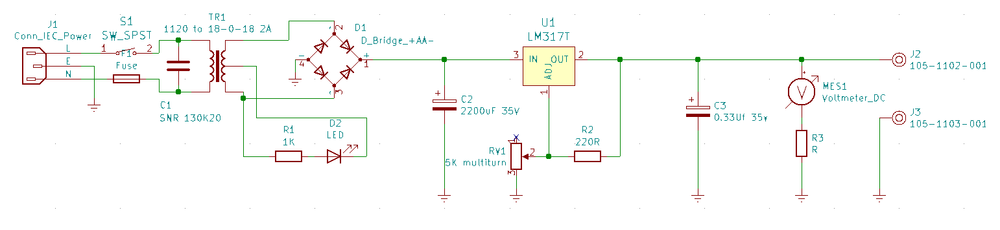

# Vintage Adjustable Linear Power Supply

Updating and improving on a very early project I built.

* Partly because I want something to do more things - dual tracking adjustable regulated outputs.
* Partly because I wanted to see how far I have come in my design skills from 10 year old me.
* Partly because I am bored

 I have been wanting to get more into analog circuits, like op-amp circuits and amplifiers. Building these on breadboards has always been challenging for me because I have always had only one bench power supply.  I have a modern bench power supply, but it also only has one output on it.

## TL;DR

This is now a dual channel, double trackking voltage power supply.

Each channel can do about +/-1.2V to +/-20V at about 1A

## Analysis

I created this (I think) when I was in grade 4. So probably around 1987?

* Simple 317 regulator based adjustable power supply.

* Most components were baught from local Radio Shack store in St Vital mall.

  * Radio Shack project box.
  * 18V CT, 2A (36VA?) transformer.
  * Bridge Rectifier.
  * 2200uF capacitor
  * 317 volt regulator on free hanging heatsink.
  * Basic power connector, switch, fuze, with shitty heat shrink tubing on it.
  * Analog DC volt meter.
  * Indicator lamp, but bulb burnt out so I replaced it at some time with a LED stuffed into the lamp holder.
  * A pointless inline fuse holder, with a 2A fuse. This never would blow because the thing can only source 1A
  * Adjustable voltage knob - I remember getting this multi turn potentiometer from Active Electronics.
  * Custom etched single sided PCB
  * Serrible banana plug jacks.
  * Board standoffs (Active Electronics - I still have these) with stove bolts from hardware store.

I would like to say "I have come a long way since then". But at the same time, not really.

* I don't have a convenient way to make circuit boards at home any more.

This gem was hand drawn with a sharpie and then using a liquid tin to protect the copper.

In hindsight this is a terrible board layout.

* I still do not have good nuts and bolts hardware to mount circuit boards.

I have learned or improved a little bit more since I built this:

* I do have much better selection of wires now.

* My soldering skills are a lot better. This thing looks like a Halloween house of horrors.

## Original Schematic

I created this in Kicad

This still functioned very well.

Funny notes as I was taking the old circuit apart.

* The C1 makes no sense. Why did I think I needed to have a ac line capacitor here? I probably had these and copied what I saw in other power supplies.
* The F1 should be after the switch on the hot side.
* The wires from J1, S1, T1 were a white lamp cord. I remember having this and using it for everything.
* The wires from T1 to the circuit board and everywhere else were from an old datacom cable I salvaged from one of my dad's construction sites. I stripped the cable jacket and used the wires for projects.
* I made a PCB using the kit from RadioShack. It is horrible layout and terrible pattern. But I did it with a sharpie and I was 8.
* The J2 was a metal not insulated binding post. As a kid I converted it into an insulated binding post by placing a piece of plastic drinking straw around the metal screw part of the  between the connector and the chassis. Somehow it continued to work all these years.

## Improvements

As usual I can't leave anything alone. Nothing is ever truly completed is it.

I ripped apart the old circuit and removed the parts from the chassis.  The front panel and bottom was a bit bent up from this being knocked around in storage I guess.

### Support more current output

* [Researching](https://www.homemade-circuits.com/lm317-with-outboard-current-boost/) adding a transistor to boost the current handling.

* https://www.ti.com/lit/ds/slvs044x/slvs044x.pdf

This is fun. But I think this is too complicated. And the parts and heatsinks will take up too much space in this small chassis.

And considering the power transformer here is very small, I would be able to fully use this.

Instead, let's just use a [LD1085D2T-R‎](https://www.digikey.ca/product-detail/en/LD1085D2T-R/497-3424-1-ND/669200/?itemSeq=339103460). This has a power capacity of 3A.  And being a surface mount device I can use the PCB as the heatsink.

## More voltage outputs

I think having a single output is kind of useless for me.

* To build a variable output. But to build it as a [dual tracking control](https://www.youtube.com/watch?v=AOIxS7iOxbU). This is pretty neat. But the devil in the details of the op-amp needs a +/- power supply.

* A +/-15V supply for op-amps.

> HEY!!  I had "build a nice bench top op-amp power supply as one of my active projects.  I never got it out of design phase though. But what if I just build it into this existing power supply chassis I alredy have.  That seems practical to me too.

The dual tracking adjustable supply is neat as I do not have this with my existing bench top power supplies.

I think it is going to be challenging to fit all this stuff into this small chassis.

I compromised and designed a dual output dual tracking power supply. This gives me two channels of adjustable +/- voltage.

Each channel allows the use of a trimmer pot on the pcb, so it can practically behave as a fixed voltage.

I think I will go with having one channel be variable from the front panel and the other to be set with a trimmer.

## Updated schematic

This is in the updated folder, opamp_power_supply sub folder.

I started off with this Hammoond 229B34. It is a nice 12VA low profile transformer. It is semi-toroidial, so it has ok magnetic shielding as well. I was looking for something that had low electrical and magnetic noise. The original idea was to create a power supply suitable for powering audio op-amp circuits.

The configuration of this transformer lends itself to being able to use the secondary in series or in parallel.  In this case the secondary series voltage was about 38V. I don't need a power supply to go that high, so most of the voltage would be disapated as heat.
using the transformer secondary in parallel gives about 18V and about 600ma current output. But then is only single supply.
The approach here where I use them as separate secondaries is somewhere in between. I have an ok voltage to supply the regulators and a bit more or basically the same current than if i used the secondary in series.  I just need to use more diodes.  Fortunately diodes are cheap.

I chose to use Shotkey diodes here instead of regular rectifier diodes, because they have a lower forward voltage drop. Which means less energy gets lost as heat. These looke like they were diode arrays for use in the secondary of a switch mode power supply. Where you would want two dioded connected together, as for a full wave rectifier with the center tap right. But here I just use them in parallel. Because it helps further with the forward voltage losses. And I have them in the package for free. I could get a single diode in a DPAK pacakge. But these were pretty cheap as well.

I wanted rediculous large filter capacitors. There are some formulas I keep finding to calculate the capacitor size for the ripple voltage under an expected load. So I tried to use those. But then when you use regulators these all go askew anyway. The regulators specify they need a minimum of a relatively small capacitance. So these are going to be more than enough anyway. Again, wanting to have the perfect smooth DC supply for use in audio quality op-amp circuits.

Each channel a pair of regulators. These are the 317 and 337 adjustable family of regulators.

And then the op-amp there to provide the inverted voltage reference to the negative regulator. This allows for a single control voltage from one adjustable resistor to have both regulators adjust at the same time.

And then more filtering after the regulation. I have ceramic and electrolytic capacitors to help with transients.

Of course the devil is in the details.

This op-amp requires its own +/-15V power supply.  But we are already building a power supply. And these are adjustable outputs at that.

So I added a small current +/-15V regulators here. These are smlal so-8 packages that are good for up to about 100mA. The op-amps I have here use much less than that.  I do not expose this supply as an output to be used off the power supply. Though I guess I could have. I didn't want this internal power that is used to control the regulators to be compromised by loading or shorting it out.

## PCB

I ordered the PCB from

<a href="https://oshpark.com/shared_projects/tLXbXLEt"></img></a>

It arrived a few weeks later.

I had the parts all ready to go. I ordered enough to build 3 modules. Because I pay for and get 3 boards anyway!. Sometimes that is a nuissance. But sometimes you can use it as a feature like this I guess.

I plan to build one into this power supply, to build a stand-alone op-amp power supply in a box. Where I set the outputs to +/-15V and +/-12V. And to have another one for use in a tube amplifier project idea I am still designing.

## Assembly

I built all three boards at the same time. At each step where I could I did some testing to make sure it was working.

* The transformer, fuze, and input connector, rectifier diodes - able to see rectified DC ripples on the filter capacitor pads.
* The capacitors - able to see DC voltage
* The 15V regulators - able to measure +/-15V
* The capacitors and resistors - bulk components. Test for continuity.
* The regulators - measure and test adjusting the voltage.

Put the board on some standoffs and mount it into the chassis

I didn't think about the potentiometers. I was just going to use the one I had from before. But when I was putting the new power supply PCB into the case I discovered it is not working very well. It feels all loose. I probably dropped this at some time and broke it. It still works but is very jittery when you turn it.

Time to replace this.

Since I am replacing it anyway and I do have space to add another potentiometer for the second channel I might as well do that now.

And get some nice knobs for this. I am tired of the classic single knob I have had forever.

I will need some more output connectors on the back. Drill in some new holes and mount the connectors.

And then wire up the connectors to the screw terminals on the PCB.

Hook up the meter.

I only bother tracking the positive voltage, since the negative will track what ever the positive is but be opposite polarity right.

I added a toggle switch beside the meter so I can switch which channel is currently being displayed on the meter.

Fix the indicator LED and put it back together.

A little bit of label maker ties it all together.

Ready to roll.